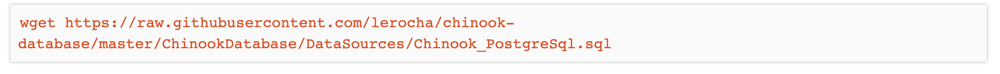

# PostgreSql DataBase.

Download the PostgreSql Chinook DataBase form GitHub to our WorkSpace:

## PostgreSql using CLI Commands:

The [wget](https://shapeshed.com/unix-wget/#what-is-the-wget-command) command is a command line utility for downloading files from the Internet.

The [psql](https://www.postgresql.org/docs/current/app-psql.html) command to launch the PostgreSql database.
 - If you get the following error after typing psql in the terminal:

    "psql: error: could not connect to server: No such file or directory".

    Please use the following command in the terminal to set an environment variable needed for it to work:

    "set_pg"

    And then try the psql command again.

The  [\l](https://www.postgresqltutorial.com/postgresql-administration/postgresql-show-databases/)  command to list all databases in the current PostgreSQL database server.

The [CREATE DATABASE](https://www.w3schools.com/sql/sql_create_db.asp) statement is used to create a new SQL database. (In our case CREATE DATABASE chinook;)

The [\c](https://www.postgresqltutorial.com/postgresql-administration/psql-commands/) command to connect to another database.(eg. to switch from postgres=# to chinook=# we type: \c chinook)

The [\i]() command to initialize (install) our chinook sql file. ( eg. \i Chinook_PostgreSql.sql).

 - (psql -d chinook) to connect to connect to the database we have created.

 The [\dt]() command allow us display tables in our database.

#### Basic PostgreSql CLI Commands:

    - SELECT - extracts data from a database
    - UPDATE - updates data in a database
    - DELETE - deletes data from a database
    - INSERT INTO - inserts new data into a database
    - CREATE DATABASE - creates a new database

To find out more about SQL please check out  this Quick Reference from [W3Schools](https://www.w3schools.com/sql/sql_quickref.asp)

## PostgreSql with Python using psycopg2 adapter

### Set-up workspace:

- Install a Python package and data adapter called [psycopg2](https://pypi.org/project/psycopg2/¦¦¦):

  - pip3 install psycopg2

- Create a new python file:

  - touch sql-psycopg2.py (be careful NOT to call it the same name as the package psycopg2)

### Python file setup:

    import psycopg2

    # connect to chinook database 
    connection = psycopg2.connect(database="chinook")

    # build a cursor object of the database
    cursor = connection.cursor()

    # fetch the results (multiple)
    results = cursor.fetchall()

    # fetch the result (single)
    # results = cursor.fetchone()

    # close the connection
    connection.close()

    # print results
    for result in results:
        print(result)

### Basics psycopg2 Queries examples:

    # Query 1 - select all records from the "Artist" table
    cursor.execute('SELECT * FROM "Artist"')

    # Query 2 - select only the "Name" column from the "Artist" table
    cursor.execute('SELECT "Name" FROM "Artist"')

    # Query 3 - select only "Queen" from the "Artist" table
    cursor.execute('SELECT * FROM "Artist" WHERE "Name" = %s ',["Queen"])

    # Query 4 - select only by "ArtistId" #51 from the "Artist" table
    cursor.execute('SELECT * FROM "Artist" WHERE "ArtistId" = %s', [51])

    # Query 5 - select only the albums with "ArtistId" #51 on the "Album" table
    cursor.execute('SELECT * FROM "Album" WHERE "ArtistId" = %s', [51])

    # Query 6 - select all tracks where the composer is "Queen" from the 
    "Track" table
    cursor.execute('SELECT * FROM "Track" WHERE "Composer" = %s', ['Queen'])

## PostgreSql with python and [SQLAlchemy](https://www.sqlalchemy.org/) using Expression Language

### Set-up workspace:

    Install SQlAlchemy library:

      pip3 install SQLAlchemy

    Create a new file:

      touch sql-expression.py

### Python file setup:

    from sqlalchemy import (
        create_engine, Table, Column, Float, ForeignKey, Integer, String, MetaData
    )

    # executing the instruction form our localhost "chinook" db
    db = create_engine("postgresql:///chinook")

    meta = MetaData(db)

    # making the connection
    with db.connect() as connection:
      results = connection.execute(select_query)

      for result in results:
        print(result)

### Basic SQLAlchemy Expression Language Queries examples:

    # Query 1 - select all records form the "Artist" table
    # select_query = artist_table.select()

    # Query 2 - select only the "Name" column from the "Artist" table
    # select_query = artist_table.select().with_only_columns([artist_table.c.Name])
    
    # Query 3 - select only 'Queen' from the "Artist" table
    # select_query = artist_table.select().where(artist_table.c.Name == 'Queen')

    # Query 4 - select only by "ArtistId" #51 from the "Artist" table
    # select_query = artist_table.select().where(artist_table.c.ArtistId == 51

    # Query 5 - select only the albums with "ArtistId" #51 on the "Album" table
    # select_query = album_table.select().where(album_table.c.ArtistId == 51)

    # Query 6 - select all tracks where the composer is 'Queen' from the "Track" table
    # select_query = track_table.select().where(track_table.c.Composer == 'Queen')

## PostgreSql with python and [SQLAlchemy](https://www.sqlalchemy.org/) using ORM (Object Relational Mapping):

### Set-up workspace:

    Install SQlAlchemy library:

      pip3 install SQLAlchemy

    Create a new file:

      touch sql-orm.py

### Python file setup:

    from sqlalchemy import (
        create_engine, Column, Float, ForeignKey, Integer, String
    )
    from sqlalchemy.ext.declarative import declarative_base
    from sqlalchemy.orm import sessionmaker

    # executing the instructions from the "chinook" database
    db = create_engine("postgresql:///chinook")
    base = declarative_base()

    # instead of connecting to the database directly, we will ask for a session
    # create a new instance of sessionmaker, then point to our engine (the db)
    Session = sessionmaker(db)

    # opens an actual session by calling the Session() subclass defined above
    session = Session()

    # creating the database using declarative_base subclass
    base.metadata.create_all(db)

### Basic SQLAlchemy ORM Queries examples are:

    # Query 1 - select all records from the "Artist" table
    # artists = session.query(Artist)
    # for artist in artists:
    #     print(artist.ArtistId, artist.Name, sep=" | ")

    # Query 2 - select only the "Name" column from the "Artist" table
    # artists = session.query(Artist)
    # for artist in artists:
    #     print(artist.Name)

    # Query 3 - select only the 'Queen' from the "Artist" table
    # artist = session.query(Artist).filter_by(Name='Queen').first()
    # print(artist.ArtistId, artist.Name, sep=" | ")

    # # Query 4 - select only by "ArtistId"  #51 from the "Artist" table
    # artist = session.query(Artist).filter_by(ArtistId=51).first()
    # print(artist.ArtistId, artist.Name, sep=" | ")

    # Query 5 - select only the albums with "ArtistId" #51 from the "Album" table
    # albums = session.query(Album).filter_by(ArtistId=51)
    # for album in albums:
    #     print(album.AlbumId, album.Title, album.ArtistId, sep=" | ")

    # Query 6 - select all tracks by "Composer" 'Queen' from the "Track" table
    # tracks = session.query(Track).filter_by(Composer='Queen')
    # for track in tracks:
        print(
            track.TrackId,
            track.Name,
            track.AlbumId,
            track.MediaTypeId,
            track.GenreId,
            track.Composer,
            track.Milliseconds,
            track.Bytes,
            track.UnitPrice,
            sep=" | "
            )

## PostgreSql with python and [SQLAlchemy](https://www.sqlalchemy.org/) using ORM + CRUD funtionality:

### Set-up workspace:

    Create a new file:

      touch sql-crud.py
### Python file set-up:

    from sqlalchemy import (
        create_engine, Column, Integer, String
    )
    from sqlalchemy.ext.declarative import declarative_base
    from sqlalchemy.orm import sessionmaker

    # executing the instructions from the "chinook" database
    db = create_engine("postgresql:///chinook")
    base = declarative_base()

    # instead of connecting to the database directly, we will ask for a session
    # create a new instance of sessionmaker, then point to our engine (the db)
    Session = sessionmaker(db)
    # opens an actual session by calling the Session() subclass defined above
    session = Session()

    # creating the database using declarative_base subclass
    base.metadata.create_all(db)

### [C]reate a new table

    # create a class-based model for the "Programmer" table
    class Programmer(base):
        __tablename__ = "Programmer"
        id = Column(Integer, primary_key=True)
        first_name = Column(String)
        last_name = Column(String)
        gender = Column(String)
        nationality = Column(String)
        # famous_for = Column(String)

### [C]reate a new record

    # creating records on our Progammer table
    ada_lovelace = Programmer(
        first_name="Ada",
        last_name="Lovelace",
        gender="F",
        nationality="British",
        # famous_for="First Programmer"
        )

### Add a new record

    # add each instance of our programmers to our session
    # session.add(ada_lovelace)

### [R]ead records

    # query the database to find all Programmers
    programmers = session.query(Programmer)
    for programmer in programmers:
        print(
            programmer.id,
            programmer.first_name + " " + programmer.last_name,
            programmer.gender,
            programmer.nationality,
            # programmer.famous_for,
            sep=" | "
        )

### [U]pdating a single record by id

        # updating a single record
        # programmer = session.query(Programmer).filter_by(id=7).first()
        # programmer.famous_for = "World President"

### [U]pdating multiple records

        # updating multiple records
        # people = session.query(Programmer)
        # for person in people:
        #     if person.gender == "F":
        #         person.gender = "Female"
        #     elif person.gender == "M":
        #         person.gender = "Male"
        #     else:
        #         print("Gender not defined")

### [D]elete a single record

    # deleting a single record
    # fname = input("Enter a first name: ")
    # lname = input("Enter a last name: ")
    # programmer = session.query(Programmer).filter_by(
    # first_name=fname, last_name=lname).first()
    # defensive programming
    # if programmer is not None:
    #     print(
    # "Programmer Found: ", programmer.first_name + " " + programmer.last_name)
    #     confirmation = input(
    # "Are you sure you want to delete this record? (y/n) ")
    #     if confirmation.lower() == "y":
    #         session.delete(programmer)
    #         session.commit()
    #         print("Programmer has been deleted")
    #     else:
    #         print("Programmer not deleted")
    # else:
    #     print("No records found")

### [D]elete multiple/all records (Don't use it unless completely sure)

    # delete multiple/all records
    # programmers = session.query(Programmer)
    # for programmer in programmers:
    #     session.delete(programmer)
### Commit a new record || session

    # commit our session to the database
    # session.commit()

---

Happy coding!
